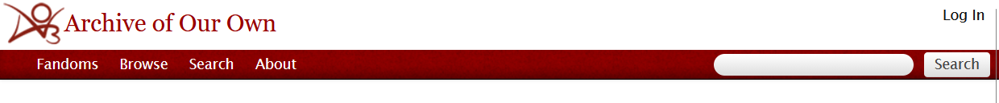
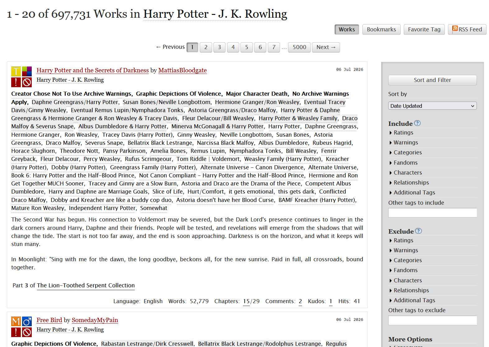
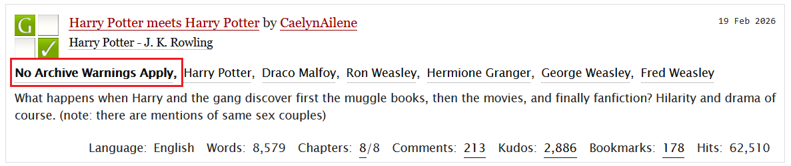
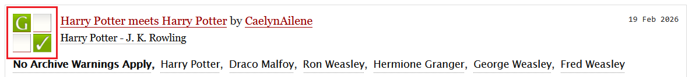
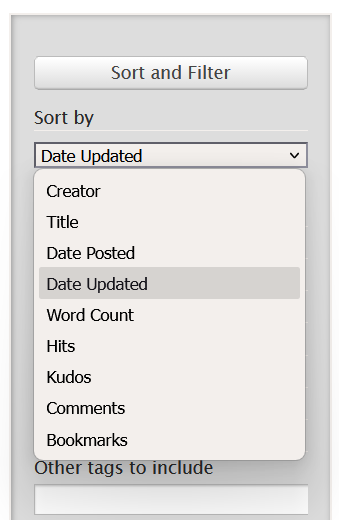

---
title:
aliases:
  - Getting started with browsing AO3
---
# End-user Quick-start guide
!!! info "Source material"
    - https://web.archive.org/web/20260902150500/https://archiveofourown.org/faq?language_id=en
    - https://web.archive.org/web/20260901122902/https://archiveofourown.org/tos_faq
## About this guide
In this quick-start guide, you'll learn how to browse the large online content archive Archive of Our Own (AO3) to find a story to read.
## Finding a story
AO3 uses several search interfaces. In this quick-start guide, we'll use the **global search bar** to find a story (called '*work*' on AO3). The **global search bar** shows up in the top right corner the main menu.

### Step 1: Finding a fandom
1. In the **global search bar**, type in the name of fandom you want to read in. Click **search**. An overview of works that match your search results appear. 
2. Click on the **fandom tag** (written in black and underlined, right below the work's title and author). A new page will load with the title `1-20 of {total number of} works in {fandom}` and a **Sort and Filter sidebar** *(if you're on a phone or tablet, the sidebar will be hidden under the button **Filters**)*.

!!! help "Can't find your fandom via global search?"
    The fandoms page contains an overview of all fandoms hosted on AO3: https://archiveofourown.org/media. Find on the fandom you want to read, and continue to the step below. 
   
The final search results page will look something like this:
   

!!! tip
    Each work in your search results shows several tags — fandom, warnings, relationships, characters, and more. We'll cover how to use these to filter your results in the [Searching for a genre](#searching-for-a-genre) section.

### Step 2: Filtering content
All works on AO3 must be tagged using their two major classifications systems:

- [**Warnings**](https://archiveofourown.org/tos_faq#warnings_list): graphic depictions of violence, major character death, rape/non-con, underage sex
- [**Ratings**](https://archiveofourown.org/tos_faq#ratings_list): general audiences, teen and up audiences, mature, explicit

#### Warning tags
On the search results page, you can find the **Warnings** for each work as the first tags listed, in bold, below the story's title and fandom tag:
 

#### Warning and Rating symbols
You can also find four [symbols](https://archiveofourown.org/help/symbols_key)  next to the work title and fandom tag. The top left symbol represents the work's **Rating**. The bottom left symbol tells you if the story contains any archive **Warnings**:
 

!!! warning "Special category: Creator Chose Not To Use Archive Warnings"
    This category means the author did not select any warnings, e.g. to avoid spoilers. It does *not* mean there are no warnings.
#### Filtering works
To filter out specific content, use the **Sort and Filter sidebar**:

1. In the **Sort and Filter** **sidebar**, select the Warnings you want to exclude using the **Exclude** section.
2. Select the specific **Ratings** you want to exclude.
3. Click **Sort and filter** to update the search results.
## Finding popular works
Each work on AO3 comes with several public metrics: 

- [Comments](https://archiveofourown.org/faq/comments-and-kudos?language_id=en#whatarecomments)
- [Kudos](https://archiveofourown.org/faq/statistics?language_id=en#statskudo)
- [Bookmarks](https://archiveofourown.org/faq/statistics?language_id=en#statsbookmarks)
- [Hits](https://archiveofourown.org/faq/statistics?language_id=en#hitstats)

As a rule of thumb, a story with more kudos, hits, bookmarks and comments is more popular — though raw numbers vary a lot between small and large fandoms. 
### Sorting by metric
To sort the search results by metrics, you can use the **Sort and Filter sidebar**:

1. At the top of the **Sort and Filter** **sidebar**, click on the **Sort by** dropdown menu:
2. Choose the metric you want to sort by: Hits, Kudos, Comments, or Bookmarks. 
3. Click **Sort and Filter** to update the search results. 

## Searching for a genre
Similar to a library, works on AO3 fall in a specific 'genre'. The **Sort and Filter sidebar** offers several types of [tags](https://archiveofourown.org/faq/tags?language_id=en#tagtypes) to filter:

- **Categories**: The presence and/or type of relationships 
- **Characters**: The main characters present in the work. 
- **Relationships**: If the work focuses on a relationship, this tag shows which characters it involves.
- **Additional Tags**: Tags that describe the type of story, specific story elements, etcetera. 

!!! tip "Genres on AO3"
    AO3 doesn't have traditional genre categories. Instead, readers stack **additional tags** to find a specific vibe or trope. These tags can describe things such as mood (fluff, angst, slow burn), tropes (enemies to lovers, fix-it fic), or fandom-specific concepts (Hogwarts, The Force).
    
    For example, `Slow Burn + Hurt/Comfort + Canon Divergence` tells you you're looking at a long, character-focused story that doesn't follow the original book/film. 

    If you're not sure what to look for, search for AO3 tagging guides or ask AI — the latter might hallucinate some non-existent tags but is generally a good starting point.

### Filtering by tags
1. In the **Sort and Filter sidebar**, look for the **Include** section.
2. Select the **categories**, **characters**, **relationships** and/or **additional tags** you're looking for.
3. *Optionally, select the tags you would like to exclude in the **Exclude** section of the sidebar.*
4. Click **Sort and Filter**.

!!! tip
    The Sort and Filter sidebar is automatically populated with the 10 most common Characters, Relationships and Additional Tags available. That means that once you update your search results, it will repopulate with the most common tags in your updated search results. That way, you can keep refining your results. 

## Finding a fic for your lunch break or a long flight
AO3 contains a wealth of stories. Some short, some really long, some ongoing (Works In Progress), some finished (Completed Works). 

1. In the **Sort and Filter sidebar**, scroll to the **Search within results** box (at the bottom of the sidebar, listed under **More Options**.).
2. Enter the word count you're looking for, using the values from the table below.

| Value             | Description       | Reading duration          |
| ----------------- | ----------------- | ------------------------- |
| `words<1000`      | Under 1,000 words | 5 min or less             |
| `words:2000-3000` | 2,000–3,000 words | 10–15 min                 |
| `words>5000`      | 5,000+ words      | 20+ min                   |
| `words>20000`     | 20,000+ words     | ~1.5–1.75 hours (novella) |
| `words>50000`     | 50,000+ words     | ~3.5–4 hours              |
| `words>100000`    | 100,000+ words    | ~7–8.5 hours (novel)      |

!!! tip "AO3 automatically shows Works In Progress"
    Set the **Completion Status** box (listed under **More Options**) to *Complete works only* if you're on a long-haul flight and don't want to end the story on a cliff-hanger. 

## Wrapping up
This covers the basics of finding a work — searching by fandom, filtering by warnings and ratings, sorting by popularity, narrowing by genre tags, and filtering by length. From here, the best way to get comfortable is to just start searching and see how the tags and filters click together.